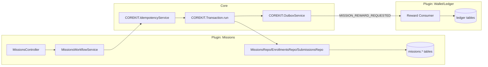
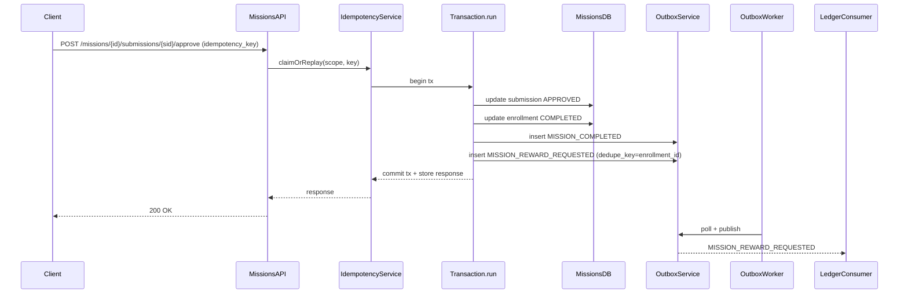

# Mission Pillar Workflow Spec for GCPro

## Executive summary

Your `yaser2us/GCPro` repository contents visible in this chat do not yet include a missions module, workflow YAML, or any source tree; the only surfaced artifacts are minimal scaffolding files (e.g., a NestJS-oriented `.gitignore` and a minimal `README.md`). fileciteturn18file0L1-L1 fileciteturn13file0L1-L1

So, below is a **ready-to-feed Mission pillar YAML spec** that follows the conventions you established earlier in this chat: **workflow-first**, **strict plugin ownership**, **outbox-driven events**, **idempotent commands**, and **deterministic code generation** (no manual edits). It is designed to let another AI/codegen system generate controllers/services/DTOs/tests for the **Missions plugin**.

## Evidence baseline from this chat

The only repository evidence available in this conversation indicates project scaffolding but no implementation modules (payments/ledger/outbox/mission/codegen) to copy from directly. fileciteturn18file0L1-L1 fileciteturn13file0L1-L1

Accordingly, the YAML below is a **spec-level implementation blueprint** consistent with your architecture rules, not a reflection of existing mission code in the repo.

## Mission pillar scope and assumptions

This spec models a typical mission lifecycle and participant workflow:

- A mission is created as **DRAFT**, then **PUBLISHED**, optionally **PAUSED**, and finally **RETIRED**.
- Participants can **ENROLL**, **SUBMIT** proof, and be **APPROVED/REJECTED**.
- When approved, the Missions plugin emits an event to request a reward. The **Ledger/Wallet plugin** (separate owner) should fulfill the reward (no cross-plugin SQL writes).

State transitions happen only through **commands**, never through CRUD updates.

## Mission YAML spec

```yaml
version: "1.0"
spec_id: "gcpro.missions.v1"
domain: "missions"
plugin: "missions"

ownership:
  owner_plugin: "missions"
  owns_tables:
    - "missions.mission"
    - "missions.mission_enrollment"
    - "missions.mission_submission"
    - "missions.mission_audit"
  cross_plugin_writes: false
  cross_plugin_integration:
    allowed_via:
      - "command_api"
      - "outbox_events"

conventions:
  workflow_discipline: ["guard", "validate", "write", "emit", "commit"]
  status_mutation_policy: "Status fields may only be mutated by command workflows."
  outbox:
    service: "COREKIT.OutboxService"
    event_naming: "UPPER_SNAKE_CASE"
    required_envelope_fields:
      - "event_name"
      - "event_version"
      - "aggregate_type"
      - "aggregate_id"
      - "actor_user_id"
      - "occurred_at"
      - "correlation_id"
      - "causation_id"
  idempotency:
    service: "COREKIT.IdempotencyService"
    required_input_field: "idempotency_key"
    default_scope: "actor_user_id + command_name"
    recommended_db_uniques:
      - "core.idempotency(scope, idempotency_key)"
  transactions:
    wrapper: "COREKIT.Transaction.run"
    rule: "All multi-table writes + outbox inserts must be atomic in one transaction."

aggregates:
  - name: "mission"
    aggregate_type: "MISSION"
    primary_key: "mission_id"
    table: "missions.mission"
    statuses: ["DRAFT", "PUBLISHED", "PAUSED", "RETIRED"]

  - name: "enrollment"
    aggregate_type: "MISSION_ENROLLMENT"
    primary_key: "enrollment_id"
    table: "missions.mission_enrollment"
    statuses: ["ENROLLED", "SUBMITTED", "COMPLETED", "CANCELLED"]

  - name: "submission"
    aggregate_type: "MISSION_SUBMISSION"
    primary_key: "submission_id"
    table: "missions.mission_submission"
    statuses: ["PENDING", "APPROVED", "REJECTED"]

types:
  Money:
    fields:
      - { name: "currency", type: "string", required: true, example: "MYR" }
      - { name: "amount_minor", type: "int64", required: true, example: 5000 }

  Actor:
    fields:
      - { name: "actor_user_id", type: "uuid", required: true }
      - { name: "actor_role", type: "string", required: true, example: "ADMIN" }

  MissionReward:
    fields:
      - { name: "reward_type", type: "string", required: true, example: "FIXED" }
      - { name: "reward_money", type: "Money", required: true }
      - { name: "reward_reason", type: "string", required: true, example: "MISSION_COMPLETION" }

dtos:
  MissionCreateRequest:
    fields:
      - { name: "idempotency_key", type: "string", required: true, max_len: 120 }
      - { name: "external_ref", type: "string", required: false, max_len: 80, description: "Client-provided stable reference for dedupe/search." }
      - { name: "title", type: "string", required: true, min_len: 3, max_len: 200 }
      - { name: "description", type: "string", required: false, max_len: 5000 }
      - { name: "starts_at", type: "datetime", required: true }
      - { name: "ends_at", type: "datetime", required: true }
      - { name: "max_participants", type: "int32", required: false }
      - { name: "reward", type: "MissionReward", required: true }
      - { name: "tags", type: "string[]", required: false, max_items: 20 }
      - { name: "visibility", type: "string", required: true, example: "PUBLIC" }

  MissionPublishRequest:
    fields:
      - { name: "idempotency_key", type: "string", required: true, max_len: 120 }

  MissionPauseRequest:
    fields:
      - { name: "idempotency_key", type: "string", required: true, max_len: 120 }
      - { name: "reason", type: "string", required: true, max_len: 300 }

  MissionRetireRequest:
    fields:
      - { name: "idempotency_key", type: "string", required: true, max_len: 120 }
      - { name: "reason", type: "string", required: true, max_len: 300 }

  MissionEnrollRequest:
    fields:
      - { name: "idempotency_key", type: "string", required: true, max_len: 120 }

  MissionSubmitProofRequest:
    fields:
      - { name: "idempotency_key", type: "string", required: true, max_len: 120 }
      - { name: "proof_type", type: "string", required: true, example: "TEXT" }
      - { name: "proof_payload", type: "json", required: true, description: "Proof payload; schema depends on proof_type." }

  MissionApproveSubmissionRequest:
    fields:
      - { name: "idempotency_key", type: "string", required: true, max_len: 120 }
      - { name: "approval_note", type: "string", required: false, max_len: 1000 }

  MissionRejectSubmissionRequest:
    fields:
      - { name: "idempotency_key", type: "string", required: true, max_len: 120 }
      - { name: "rejection_reason", type: "string", required: true, max_len: 500 }

events:
  - name: "MISSION_CREATED"
    version: 1
    aggregate_type: "MISSION"
    required_fields:
      - "mission_id"
      - "title"
      - "starts_at"
      - "ends_at"
      - "reward"
      - "visibility"

  - name: "MISSION_PUBLISHED"
    version: 1
    aggregate_type: "MISSION"
    required_fields: ["mission_id"]

  - name: "MISSION_PAUSED"
    version: 1
    aggregate_type: "MISSION"
    required_fields: ["mission_id", "reason"]

  - name: "MISSION_RETIRED"
    version: 1
    aggregate_type: "MISSION"
    required_fields: ["mission_id", "reason"]

  - name: "MISSION_ENROLLED"
    version: 1
    aggregate_type: "MISSION_ENROLLMENT"
    required_fields: ["mission_id", "enrollment_id", "participant_user_id"]

  - name: "MISSION_SUBMISSION_RECEIVED"
    version: 1
    aggregate_type: "MISSION_SUBMISSION"
    required_fields: ["mission_id", "enrollment_id", "submission_id", "participant_user_id"]

  - name: "MISSION_SUBMISSION_APPROVED"
    version: 1
    aggregate_type: "MISSION_SUBMISSION"
    required_fields: ["mission_id", "enrollment_id", "submission_id"]

  - name: "MISSION_SUBMISSION_REJECTED"
    version: 1
    aggregate_type: "MISSION_SUBMISSION"
    required_fields: ["mission_id", "enrollment_id", "submission_id", "rejection_reason"]

  - name: "MISSION_COMPLETED"
    version: 1
    aggregate_type: "MISSION_ENROLLMENT"
    required_fields: ["mission_id", "enrollment_id", "participant_user_id"]

  - name: "MISSION_REWARD_REQUESTED"
    version: 1
    aggregate_type: "MISSION_ENROLLMENT"
    required_fields:
      - "mission_id"
      - "enrollment_id"
      - "participant_user_id"
      - "reward"
      - "reward_request_id"
      - "reward_idempotency_key"
    notes:
      - "Consumed by wallet/ledger plugin; missions plugin must not write ledger tables."

commands:
  - name: "Mission.Create"
    http: { method: "POST", path: "/v1/missions" }
    actor:
      required: true
      permissions_any: ["missions:admin", "missions:manage"]
    request_dto: "MissionCreateRequest"
    idempotency:
      scope: "actor_user_id + command_name"
      key_from: "$.idempotency_key"
      returns_previous_response_on_replay: true
    load:
      - name: "existing_by_external_ref"
        optional: true
        query:
          table: "missions.mission"
          where:
            external_ref: "$.external_ref"
    guards:
      - expr: "$.ends_at > $.starts_at"
        on_fail: { code: "INVALID_TIME_RANGE" }
      - expr: "$.external_ref == null || existing_by_external_ref == null"
        on_fail: { code: "MISSION_EXTERNAL_REF_EXISTS" }
    write:
      transaction: "COREKIT.Transaction.run"
      steps:
        - name: "insert_mission"
          action: "insert"
          table: "missions.mission"
          assigns:
            mission_id: "uuid_v7()"
            status: "DRAFT"
            title: "$.title"
            description: "$.description"
            external_ref: "$.external_ref"
            starts_at: "$.starts_at"
            ends_at: "$.ends_at"
            max_participants: "$.max_participants"
            reward_json: "$.reward"
            tags_json: "$.tags"
            visibility: "$.visibility"
            created_by_user_id: "actor.actor_user_id"
    emit:
      - via: "outbox"
        event: "MISSION_CREATED"
        aggregate_type: "MISSION"
        aggregate_id: "insert_mission.mission_id"
        actor_user_id: "actor.actor_user_id"
        payload:
          mission_id: "insert_mission.mission_id"
          title: "$.title"
          starts_at: "$.starts_at"
          ends_at: "$.ends_at"
          reward: "$.reward"
          visibility: "$.visibility"
    response:
      status: 201
      body:
        mission_id: "insert_mission.mission_id"
        status: "DRAFT"

  - name: "Mission.Publish"
    http: { method: "POST", path: "/v1/missions/{mission_id}/publish" }
    actor:
      required: true
      permissions_any: ["missions:admin", "missions:manage"]
    request_dto: "MissionPublishRequest"
    path_params:
      - { name: "mission_id", type: "uuid", required: true }
    idempotency:
      scope: "actor_user_id + command_name + mission_id"
      key_from: "$.idempotency_key"
      returns_previous_response_on_replay: true
    load:
      - name: "mission"
        required: true
        query:
          table: "missions.mission"
          where: { mission_id: "{mission_id}" }
    guards:
      - expr: "mission.status == 'DRAFT' || mission.status == 'PAUSED'"
        on_fail: { code: "MISSION_NOT_PUBLISHABLE" }
      - expr: "now() < mission.ends_at"
        on_fail: { code: "MISSION_ALREADY_ENDED" }
    write:
      transaction: "COREKIT.Transaction.run"
      steps:
        - name: "update_mission"
          action: "update"
          table: "missions.mission"
          where: { mission_id: "{mission_id}" }
          set:
            status: "PUBLISHED"
            published_at: "now()"
            updated_by_user_id: "actor.actor_user_id"
    emit:
      - via: "outbox"
        event: "MISSION_PUBLISHED"
        aggregate_type: "MISSION"
        aggregate_id: "{mission_id}"
        actor_user_id: "actor.actor_user_id"
        payload:
          mission_id: "{mission_id}"
    response:
      status: 200
      body: { mission_id: "{mission_id}", status: "PUBLISHED" }

  - name: "Mission.Pause"
    http: { method: "POST", path: "/v1/missions/{mission_id}/pause" }
    actor:
      required: true
      permissions_any: ["missions:admin", "missions:manage"]
    request_dto: "MissionPauseRequest"
    path_params:
      - { name: "mission_id", type: "uuid", required: true }
    idempotency:
      scope: "actor_user_id + command_name + mission_id"
      key_from: "$.idempotency_key"
    load:
      - name: "mission"
        required: true
        query: { table: "missions.mission", where: { mission_id: "{mission_id}" } }
    guards:
      - expr: "mission.status == 'PUBLISHED'"
        on_fail: { code: "MISSION_NOT_PAUSABLE" }
    write:
      transaction: "COREKIT.Transaction.run"
      steps:
        - name: "pause_mission"
          action: "update"
          table: "missions.mission"
          where: { mission_id: "{mission_id}" }
          set:
            status: "PAUSED"
            pause_reason: "$.reason"
            paused_at: "now()"
            updated_by_user_id: "actor.actor_user_id"
    emit:
      - via: "outbox"
        event: "MISSION_PAUSED"
        aggregate_type: "MISSION"
        aggregate_id: "{mission_id}"
        actor_user_id: "actor.actor_user_id"
        payload:
          mission_id: "{mission_id}"
          reason: "$.reason"
    response:
      status: 200
      body: { mission_id: "{mission_id}", status: "PAUSED" }

  - name: "Mission.Retire"
    http: { method: "POST", path: "/v1/missions/{mission_id}/retire" }
    actor:
      required: true
      permissions_any: ["missions:admin", "missions:manage"]
    request_dto: "MissionRetireRequest"
    path_params:
      - { name: "mission_id", type: "uuid", required: true }
    idempotency:
      scope: "actor_user_id + command_name + mission_id"
      key_from: "$.idempotency_key"
    load:
      - name: "mission"
        required: true
        query: { table: "missions.mission", where: { mission_id: "{mission_id}" } }
    guards:
      - expr: "mission.status != 'RETIRED'"
        on_fail: { code: "MISSION_ALREADY_RETIRED" }
    write:
      transaction: "COREKIT.Transaction.run"
      steps:
        - name: "retire_mission"
          action: "update"
          table: "missions.mission"
          where: { mission_id: "{mission_id}" }
          set:
            status: "RETIRED"
            retire_reason: "$.reason"
            retired_at: "now()"
            updated_by_user_id: "actor.actor_user_id"
    emit:
      - via: "outbox"
        event: "MISSION_RETIRED"
        aggregate_type: "MISSION"
        aggregate_id: "{mission_id}"
        actor_user_id: "actor.actor_user_id"
        payload:
          mission_id: "{mission_id}"
          reason: "$.reason"
    response:
      status: 200
      body: { mission_id: "{mission_id}", status: "RETIRED" }

  - name: "Mission.Enroll"
    http: { method: "POST", path: "/v1/missions/{mission_id}/enroll" }
    actor:
      required: true
      permissions_any: ["missions:enroll", "missions:participant"]
    request_dto: "MissionEnrollRequest"
    path_params:
      - { name: "mission_id", type: "uuid", required: true }
    idempotency:
      scope: "actor_user_id + command_name + mission_id"
      key_from: "$.idempotency_key"
      returns_previous_response_on_replay: true
    load:
      - name: "mission"
        required: true
        query: { table: "missions.mission", where: { mission_id: "{mission_id}" } }
      - name: "existing_enrollment"
        optional: true
        query:
          table: "missions.mission_enrollment"
          where:
            mission_id: "{mission_id}"
            participant_user_id: "actor.actor_user_id"
    guards:
      - expr: "mission.status == 'PUBLISHED'"
        on_fail: { code: "MISSION_NOT_OPEN" }
      - expr: "now() >= mission.starts_at && now() <= mission.ends_at"
        on_fail: { code: "MISSION_NOT_IN_WINDOW" }
      - expr: "existing_enrollment == null"
        on_fail: { code: "ALREADY_ENROLLED" }
    write:
      transaction: "COREKIT.Transaction.run"
      steps:
        - name: "insert_enrollment"
          action: "insert"
          table: "missions.mission_enrollment"
          assigns:
            enrollment_id: "uuid_v7()"
            mission_id: "{mission_id}"
            participant_user_id: "actor.actor_user_id"
            status: "ENROLLED"
            enrolled_at: "now()"
    emit:
      - via: "outbox"
        event: "MISSION_ENROLLED"
        aggregate_type: "MISSION_ENROLLMENT"
        aggregate_id: "insert_enrollment.enrollment_id"
        actor_user_id: "actor.actor_user_id"
        payload:
          mission_id: "{mission_id}"
          enrollment_id: "insert_enrollment.enrollment_id"
          participant_user_id: "actor.actor_user_id"
    response:
      status: 201
      body:
        enrollment_id: "insert_enrollment.enrollment_id"
        mission_id: "{mission_id}"
        status: "ENROLLED"

  - name: "Mission.SubmitProof"
    http: { method: "POST", path: "/v1/missions/{mission_id}/submissions" }
    actor:
      required: true
      permissions_any: ["missions:enroll", "missions:participant"]
    request_dto: "MissionSubmitProofRequest"
    path_params:
      - { name: "mission_id", type: "uuid", required: true }
    idempotency:
      scope: "actor_user_id + command_name + mission_id"
      key_from: "$.idempotency_key"
      returns_previous_response_on_replay: true
    load:
      - name: "mission"
        required: true
        query: { table: "missions.mission", where: { mission_id: "{mission_id}" } }
      - name: "enrollment"
        required: true
        query:
          table: "missions.mission_enrollment"
          where:
            mission_id: "{mission_id}"
            participant_user_id: "actor.actor_user_id"
    guards:
      - expr: "mission.status == 'PUBLISHED'"
        on_fail: { code: "MISSION_NOT_OPEN" }
      - expr: "enrollment.status == 'ENROLLED' || enrollment.status == 'SUBMITTED'"
        on_fail: { code: "ENROLLMENT_NOT_SUBMITTABLE" }
    write:
      transaction: "COREKIT.Transaction.run"
      steps:
        - name: "insert_submission"
          action: "insert"
          table: "missions.mission_submission"
          assigns:
            submission_id: "uuid_v7()"
            mission_id: "{mission_id}"
            enrollment_id: "enrollment.enrollment_id"
            participant_user_id: "actor.actor_user_id"
            status: "PENDING"
            proof_type: "$.proof_type"
            proof_payload_json: "$.proof_payload"
            submitted_at: "now()"
        - name: "update_enrollment_status"
          action: "update"
          table: "missions.mission_enrollment"
          where: { enrollment_id: "enrollment.enrollment_id" }
          set:
            status: "SUBMITTED"
            last_submission_id: "insert_submission.submission_id"
            updated_at: "now()"
    emit:
      - via: "outbox"
        event: "MISSION_SUBMISSION_RECEIVED"
        aggregate_type: "MISSION_SUBMISSION"
        aggregate_id: "insert_submission.submission_id"
        actor_user_id: "actor.actor_user_id"
        payload:
          mission_id: "{mission_id}"
          enrollment_id: "enrollment.enrollment_id"
          submission_id: "insert_submission.submission_id"
          participant_user_id: "actor.actor_user_id"
    response:
      status: 201
      body:
        submission_id: "insert_submission.submission_id"
        enrollment_id: "enrollment.enrollment_id"
        status: "PENDING"

  - name: "Mission.ApproveSubmission"
    http: { method: "POST", path: "/v1/missions/{mission_id}/submissions/{submission_id}/approve" }
    actor:
      required: true
      permissions_any: ["missions:admin", "missions:review"]
    request_dto: "MissionApproveSubmissionRequest"
    path_params:
      - { name: "mission_id", type: "uuid", required: true }
      - { name: "submission_id", type: "uuid", required: true }
    idempotency:
      scope: "actor_user_id + command_name + submission_id"
      key_from: "$.idempotency_key"
      returns_previous_response_on_replay: true
    load:
      - name: "mission"
        required: true
        query: { table: "missions.mission", where: { mission_id: "{mission_id}" } }
      - name: "submission"
        required: true
        query:
          table: "missions.mission_submission"
          where:
            submission_id: "{submission_id}"
            mission_id: "{mission_id}"
      - name: "enrollment"
        required: true
        query:
          table: "missions.mission_enrollment"
          where:
            enrollment_id: "submission.enrollment_id"
    guards:
      - expr: "submission.status == 'PENDING'"
        on_fail: { code: "SUBMISSION_NOT_APPROVABLE" }
      - expr: "enrollment.status == 'SUBMITTED'"
        on_fail: { code: "ENROLLMENT_NOT_COMPLETABLE" }
    write:
      transaction: "COREKIT.Transaction.run"
      steps:
        - name: "approve_submission"
          action: "update"
          table: "missions.mission_submission"
          where: { submission_id: "{submission_id}" }
          set:
            status: "APPROVED"
            approved_at: "now()"
            approved_by_user_id: "actor.actor_user_id"
            approval_note: "$.approval_note"
        - name: "complete_enrollment"
          action: "update"
          table: "missions.mission_enrollment"
          where: { enrollment_id: "enrollment.enrollment_id" }
          set:
            status: "COMPLETED"
            completed_at: "now()"
            updated_at: "now()"
        - name: "derive_reward_request"
          action: "derive"
          assigns:
            reward_request_id: "uuid_v7()"
            reward_idempotency_key: "concat('mission_reward:', enrollment.enrollment_id)"
    emit:
      - via: "outbox"
        event: "MISSION_SUBMISSION_APPROVED"
        aggregate_type: "MISSION_SUBMISSION"
        aggregate_id: "{submission_id}"
        actor_user_id: "actor.actor_user_id"
        payload:
          mission_id: "{mission_id}"
          enrollment_id: "enrollment.enrollment_id"
          submission_id: "{submission_id}"
      - via: "outbox"
        event: "MISSION_COMPLETED"
        aggregate_type: "MISSION_ENROLLMENT"
        aggregate_id: "enrollment.enrollment_id"
        actor_user_id: "actor.actor_user_id"
        payload:
          mission_id: "{mission_id}"
          enrollment_id: "enrollment.enrollment_id"
          participant_user_id: "enrollment.participant_user_id"
      - via: "outbox"
        event: "MISSION_REWARD_REQUESTED"
        aggregate_type: "MISSION_ENROLLMENT"
        aggregate_id: "enrollment.enrollment_id"
        actor_user_id: "actor.actor_user_id"
        dedupe_key: "derive_reward_request.reward_idempotency_key"
        payload:
          mission_id: "{mission_id}"
          enrollment_id: "enrollment.enrollment_id"
          participant_user_id: "enrollment.participant_user_id"
          reward: "mission.reward_json"
          reward_request_id: "derive_reward_request.reward_request_id"
          reward_idempotency_key: "derive_reward_request.reward_idempotency_key"
    response:
      status: 200
      body:
        submission_id: "{submission_id}"
        submission_status: "APPROVED"
        enrollment_id: "enrollment.enrollment_id"
        enrollment_status: "COMPLETED"

  - name: "Mission.RejectSubmission"
    http: { method: "POST", path: "/v1/missions/{mission_id}/submissions/{submission_id}/reject" }
    actor:
      required: true
      permissions_any: ["missions:admin", "missions:review"]
    request_dto: "MissionRejectSubmissionRequest"
    path_params:
      - { name: "mission_id", type: "uuid", required: true }
      - { name: "submission_id", type: "uuid", required: true }
    idempotency:
      scope: "actor_user_id + command_name + submission_id"
      key_from: "$.idempotency_key"
      returns_previous_response_on_replay: true
    load:
      - name: "submission"
        required: true
        query:
          table: "missions.mission_submission"
          where:
            submission_id: "{submission_id}"
            mission_id: "{mission_id}"
      - name: "enrollment"
        required: true
        query:
          table: "missions.mission_enrollment"
          where:
            enrollment_id: "submission.enrollment_id"
    guards:
      - expr: "submission.status == 'PENDING'"
        on_fail: { code: "SUBMISSION_NOT_REJECTABLE" }
    write:
      transaction: "COREKIT.Transaction.run"
      steps:
        - name: "reject_submission"
          action: "update"
          table: "missions.mission_submission"
          where: { submission_id: "{submission_id}" }
          set:
            status: "REJECTED"
            rejected_at: "now()"
            rejected_by_user_id: "actor.actor_user_id"
            rejection_reason: "$.rejection_reason"
        - name: "reopen_enrollment"
          action: "update"
          table: "missions.mission_enrollment"
          where: { enrollment_id: "enrollment.enrollment_id" }
          set:
            status: "ENROLLED"
            updated_at: "now()"
    emit:
      - via: "outbox"
        event: "MISSION_SUBMISSION_REJECTED"
        aggregate_type: "MISSION_SUBMISSION"
        aggregate_id: "{submission_id}"
        actor_user_id: "actor.actor_user_id"
        payload:
          mission_id: "{mission_id}"
          enrollment_id: "enrollment.enrollment_id"
          submission_id: "{submission_id}"
          rejection_reason: "$.rejection_reason"
    response:
      status: 200
      body:
        submission_id: "{submission_id}"
        submission_status: "REJECTED"
        enrollment_id: "enrollment.enrollment_id"
        enrollment_status: "ENROLLED"

codegen:
  language: "typescript"
  framework: "nestjs"
  outputs:
    dtos:
      - "src/plugins/missions/dto/mission-create.request.dto.ts"
      - "src/plugins/missions/dto/mission-publish.request.dto.ts"
      - "src/plugins/missions/dto/mission-enroll.request.dto.ts"
      - "src/plugins/missions/dto/mission-submit-proof.request.dto.ts"
      - "src/plugins/missions/dto/mission-approve-submission.request.dto.ts"
      - "src/plugins/missions/dto/mission-reject-submission.request.dto.ts"
    controllers:
      - "src/plugins/missions/controllers/missions.controller.ts"
    services:
      - "src/plugins/missions/services/missions.workflow.service.ts"
      - "src/plugins/missions/services/missions.read.service.ts"
    repositories:
      - "src/plugins/missions/repositories/missions.repo.ts"
      - "src/plugins/missions/repositories/enrollments.repo.ts"
      - "src/plugins/missions/repositories/submissions.repo.ts"
    module:
      - "src/plugins/missions/missions.module.ts"
    tests:
      - "test/missions/mission.create.e2e.spec.ts"
      - "test/missions/mission.enroll.e2e.spec.ts"
      - "test/missions/mission.submit-proof.e2e.spec.ts"
      - "test/missions/mission.approve-submission.e2e.spec.ts"
    openapi:
      - "openapi/missions.v1.generated.yaml"
    sdk:
      - "sdk/typescript/missions.client.generated.ts"
```

## How each YAML section maps to COREKIT patterns

The YAML is structured so your generator can compile it into the exact execution discipline you set earlier:

- **`commands[*].idempotency` → COREKIT.IdempotencyService**  
  The generator should create a call like `IdempotencyService.claimOrReplay(scope, idempotency_key, handler)` so retries return the same response and do not duplicate writes/events.

- **`write.transaction: COREKIT.Transaction.run` → transaction wrapper**  
  Every command’s write block runs inside one transaction. The key requirement is:  
  **domain writes + idempotency record + outbox inserts happen atomically**.

- **`emit[*].via: outbox` → COREKIT.OutboxService**  
  Each emitted event should become an outbox row within the same transaction as the write.  
  A separate dispatcher publishes to the bus after commit.

- **`events` and `conventions.outbox.required_envelope_fields` → standard event envelope**  
  Ensures every event includes: `aggregate_type`, `aggregate_id`, `actor_user_id`, and tracing fields (`correlation_id`, `causation_id`).

- **Ledger integration without cross-plugin writes**  
  `MISSION_REWARD_REQUESTED` is explicitly an integration event; it is the *only* “reward issuance” action inside Missions. The Ledger/Wallet plugin must consume it and post entries.

## Diagrams





## What to paste or upload for deeper review

To verify correctness (exactly-once reward and atomic outbox) with high confidence, paste or upload these exact categories of files from your codebase (wherever they live):

- **COREKIT transaction wrapper**
  - e.g., `src/corekit/transaction.ts`
- **Idempotency utilities + schema/migrations**
  - e.g., `src/corekit/idempotency.service.ts`
  - migrations for `core.idempotency` table and unique constraints
- **Outbox service + schema/migrations + dispatcher/worker**
  - e.g., `src/corekit/outbox.service.ts`
  - `src/workers/outbox-dispatcher.ts`
  - migrations for `core.outbox` table and indexes
- **Missions workflow service & repos**
  - e.g., `src/plugins/missions/services/missions.workflow.service.ts`
  - `src/plugins/missions/repositories/*.ts`
- **(If you have it) Ledger reward consumer**
  - e.g., `src/plugins/ledger/consumers/mission-reward-requested.consumer.ts`
- **Any “DomainError / Guard” helper**
  - e.g., `src/corekit/domain-error.ts`, `src/corekit/guard.ts`

If you paste those, I can confirm (with precision) whether:
- outbox is truly transactional,
- idempotency returns stable responses on replay,
- reward is protected from double-issue,
- and state transitions are enforced only via commands.

If you want, I can also tailor the YAML to your *actual* generator schema once you show me one existing YAML spec (even a small one) from your codegen engine.
